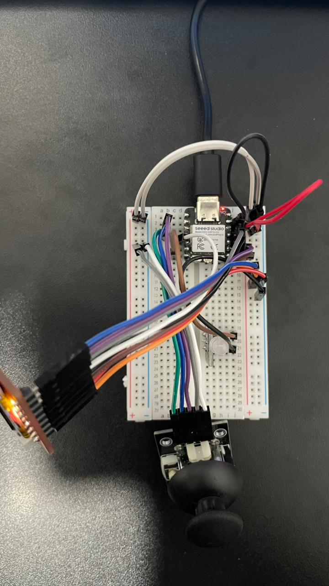
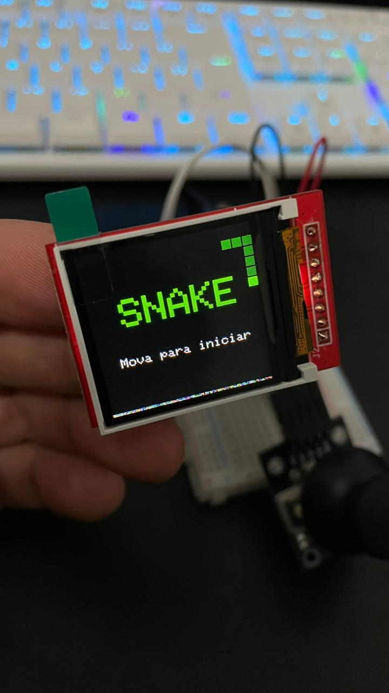
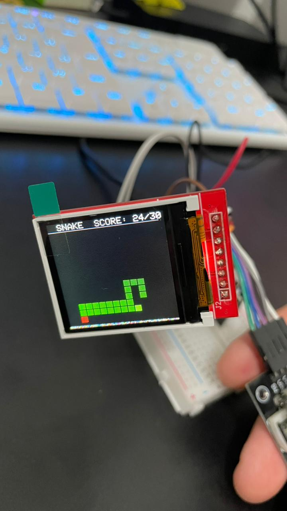
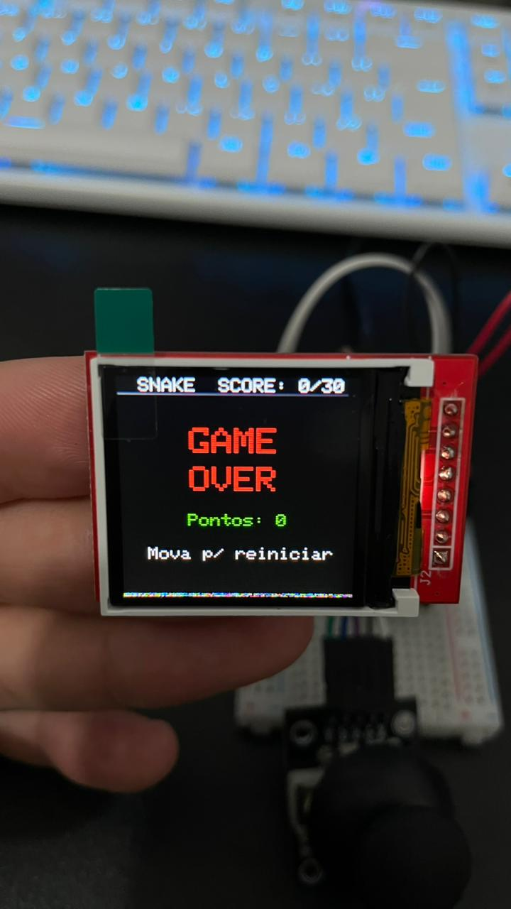

# 🐍 Snake Game — ESP32C3 + TFT Display

Um jogo Snake clássico rodando em um microcontrolador ESP32C3 com display TFT ST7735 de 128x128 pixels, construído do zero em C++ com PlatformIO.

> 🎮 Projeto de estudo: sou aluno de **Jogos Digitais** e desenvolvia apenas em C# com Unity. Ganhei um kit com ESP32 e 37 sensores e decidi mergulhar no mundo de hardware e C++. Em menos de **48 horas**, saí do zero absoluto nessa linguagem para um jogo funcional com múltiplas telas, animações e mecânicas dinâmicas — e foi incrivelmente gratificante perceber como o conhecimento de uma linguagem se transfere para outra.

<!-- 
  📸 NOTA SOBRE EXTENSÕES:
  Se suas imagens forem .png em vez de .jpeg, troque as extensões abaixo.
  Para verificar: Explorer do Windows → View → File name extensions
-->

<p align="center">
  
  
</p>

<p align="center">
  
  
</p>

---

## 🎮 Funcionalidades

- **Tela de início animada** com cobra decorativa que se move por waypoints e cresce em pontos específicos
- **Gameplay completo** com detecção de colisão (paredes e corpo próprio)
- **Velocidade dinâmica** que aumenta progressivamente a cada comida consumida
- **Sistema de buff** — frutas especiais com probabilidade configurável que dão efeitos extras
- **Condição de vitória** por pontuação (valor configurável)
- **Tela de game over e vitória** com score final e opção de reiniciar
- **Máquina de estados** com 3 estados: `ESTADO_INICIO`, `ESTADO_JOGANDO`, `ESTADO_GAMEOVER`
- **Controle por joystick analógico**
- **Variáveis de fácil acesso** para ajuste rápido de mecânicas (pontos pra vitória, tamanho inicial da cobra, probabilidade de buff, fator de velocidade, etc.)

---

## 📸 Hardware

<p align="center">
  
</p>

| Componente | Modelo / Spec |
|---|---|
| Microcontrolador | **ESP32C3 XIAO** (Seeed Studio) |
| Display | **ST7735** 128×128 BGR (SPI) |
| Joystick | Analógico XY + botão SW |
| Kit de sensores | KUONGSHUN 37-in-1 |

### 📌 Mapa de Pinos

| Pino ESP32C3 | Função | Componente |
|---|---|---|
| A1 | Eixo X | Joystick |
| A2 | Eixo Y | Joystick |
| D3 | Botão SW | Joystick |
| D4 | DC | Display ST7735 |
| D6 | Output | LED |
| D7 | CS | Display ST7735 |
| D8 | SCK | Display ST7735 |
| D9 | RST | Display ST7735 |
| D10 | MOSI | Display ST7735 |

---

## 🖥️ Telas do Jogo

<p align="center">
  
  
  
</p>

<p align="center">
  
</p>

---

## 🏗️ Arquitetura do Código

```
                    ┌──────────────┐
                    │   setup()    │
                    └──────┬───────┘
                           │
                    ┌──────▼───────┐
               ┌────┤    loop()    ├─────────┐
               │    └──────────────┘         │
               │                             │
     ┌─────────▼──────────┐     ┌────────────▼─────────────┐
     │  ESTADO_INICIO      │    │  ESTADO_GAMEOVER         │
     │  tickAnimacao()     │    │  Mostra score            │
     │  Cobra decorativa   │    │  Aguarda botão SW        │
     │  por waypoints      │    │  → volta a ESTADO_INICIO │
     └─────────┬───────────┘    └─────────────────▲────────┘
               │ (move joystick)                  │ (colisão)
     ┌─────────▼───────────┐                      │
     │  ESTADO_JOGANDO     │──────────────────────┘
     │  tickJogo()         │
     │  Movimentação       │
     │  Colisão            │
     │  Spawn de comida    │
     │  Velocidade dinâm.  │
     └─────────────────────┘
```

### Detalhes técnicos

- **Grid:** 16×14 células de 8px cada, com offset `AREA_Y = 12` para o HUD
- **Velocidade:** valor inicial configurável, multiplicada por fator ajustável a cada fruta coletada
- **Spawn:** Posição central `{7, 7}`, comida usa `do...while` para evitar o corpo
- **Texto:** Helper `printCentrado()` para centralização horizontal
- **Código bem comentado:** como projeto de aprendizado, cada seção tem explicações detalhadas — ideal para quem está aprendendo

---

## 🚀 Como Compilar e Rodar

### Opção 1 — VS Code + PlatformIO (recomendado)

1. Instale o [VS Code](https://code.visualstudio.com/) e a extensão [PlatformIO](https://platformio.org/install/ide?install=vscode)
2. Clone este repositório:
```bash
git clone https://github.com/Gab-Apolinario/snake-esp32.git
```
3. Abra a pasta no VS Code (`File → Open Folder`)
4. Conecte o ESP32C3 via USB
5. Clique em **Upload** (→) na barra inferior do PlatformIO

### Opção 2 — Arduino IDE

O projeto também funciona na Arduino IDE. Copie o conteúdo de `src/main.cpp` para um sketch novo, instale as bibliotecas `Adafruit_GFX` e `Adafruit_ST7735` pelo gerenciador de bibliotecas, e selecione a placa ESP32C3.

### Controles

- **Joystick** → move a cobra (cima, baixo, esquerda, direita)
- **Mover Joystick** → iniciar jogo / reiniciar após game over

---

## ⚙️ Variáveis Configuráveis

O código foi pensado para ser fácil de ajustar. As principais variáveis ficam no topo do `main.cpp`:

| Variável | O que faz |
|---|---|
| `pontosVitoria` | Quantos pontos para vencer |
| `tamanhoInicial` | Tamanho inicial da cobra |
| `velocidadeJogo` | Velocidade base (ms entre ticks) |
| `fatorVelocidade` | Quanto a velocidade aumenta por fruta (ex: 0.95) |
| `probBuff` | Probabilidade de spawn de fruta com buff |

---

## 📚 O que eu aprendi

Este foi meu primeiro projeto com hardware e C++. Até então, só tinha experiência com C# na Unity para desenvolvimento de jogos na faculdade.

**Programação:**
- Máquinas de estado com constantes inteiras são mais limpas que flags booleanas

- `randomSeed()` e o padrão `do...while` para posicionamento válido de comida
- A satisfação de ver conhecimento de uma linguagem se transferir naturalmente para outra

**Hardware:**
- Comunicação SPI para displays
- Leitura de sinais analógicos (joystick) e digitais (botão)
- Limitação de GPIOs força pensamento criativo sobre quais periféricos priorizar
- **Técnica de solda** — aprendi a soldar componentes durante a montagem

**Processo:**
- Em menos de 48 horas saí do zero absoluto em C++/hardware para um jogo completo e funcional
- Código fortemente comentado como ferramenta de aprendizado pessoal
- Uso de backups versionados (v1, v2, v3) antes de utilizar Git

---

## 🔮 Próximos Passos

- [ ] **Controller WiFi UDP** — transformar o ESP32 em controle wireless para jogos Unity
- [ ] **Mini-games extras** — explorar outros sensores do kit de 37 (HC-SR04, acelerômetro, etc.)
- [ ] **Controles alternativos** — integrar sensores como input para jogos da faculdade
- [ ] **Menu de seleção** de jogos no display

---

## 🗂️ Estrutura do Projeto

```
SNAKE_DISPLAY/
├── src/
│   └── main.cpp              ← código principal do jogo
├── BACKUP/
│   ├── main_v1_telaInicial.cpp
│   ├── main_v2_telaVitoria.cpp
│   └── main_v3_Simulador_velocidade.cpp
├── docs/                      ← fotos e GIFs do projeto
├── platformio.ini             ← configuração PlatformIO
├── diagram.json               ← diagrama Wokwi (simulador)
└── wokwi.toml                 ← config do simulador Wokwi
```

---

## 📝 Licença

Este projeto é open source para fins educacionais. Sinta-se livre para usar, modificar e aprender com ele.

---

<p align="center">
  <em>Feito com ☕ e muita curiosidade por um dev de jogos aprendendo embedded systems</em><br>
  <strong>Gabriel Apolinario</strong> · Jogos Digitais
</p>
