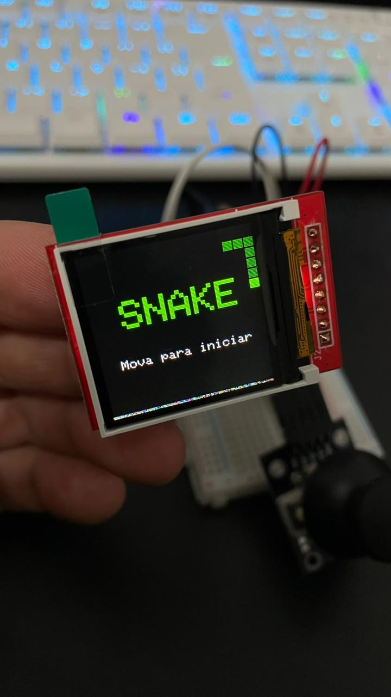
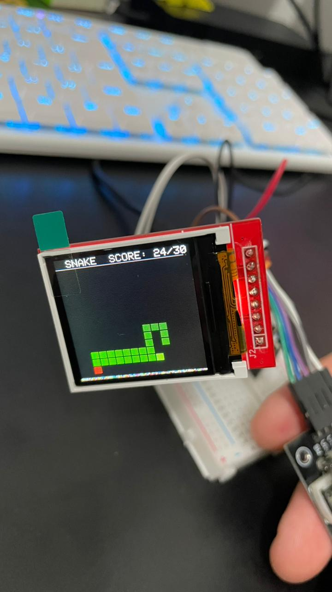
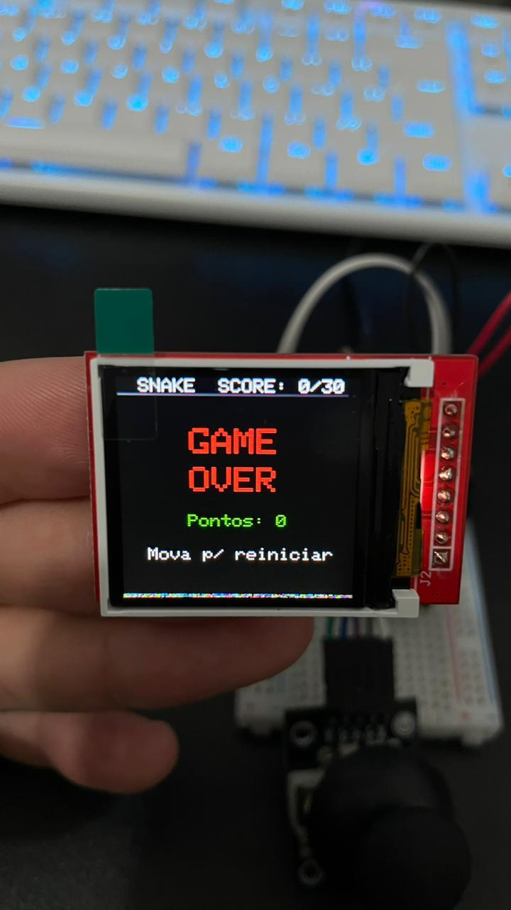
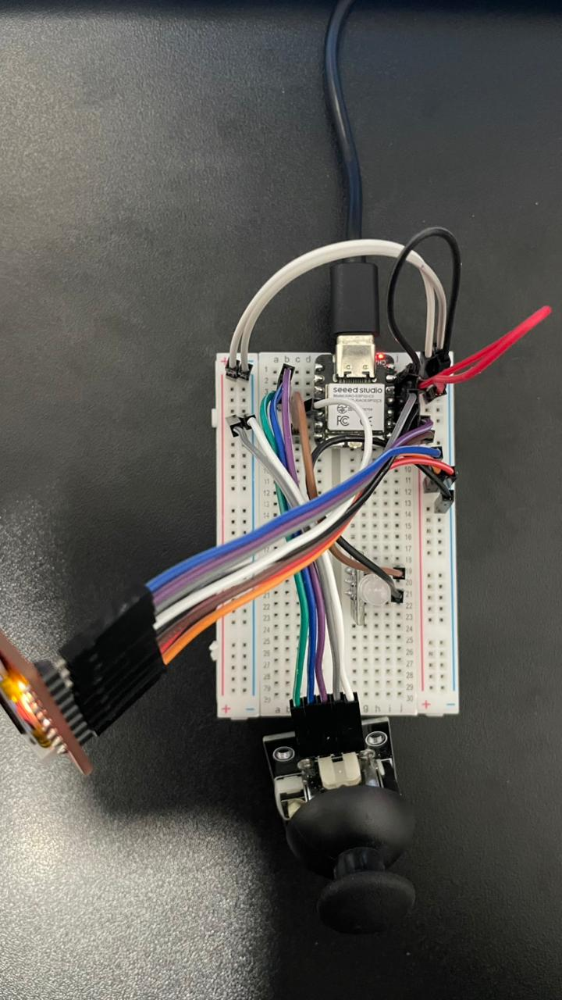

# 🐍 Snake Game — ESP32C3 + TFT Display + MPU-6050

Um jogo Snake completo rodando em um microcontrolador ESP32C3 com display TFT ST7735 de 128x128 pixels, construído do zero em C++ com PlatformIO.
  
<p align="center">
  
</p>

---

## 🖥️ Telas do Jogo

<p align="center">
  
  
  
</p>

<p align="center">
  
  
  
</p>

<p align="center">
  
</p>

---

## 🎮 Funcionalidades

- **Tela de início animada** com cobra decorativa que se move por waypoints e cresce nos cantos
- **Dois modos de controle** alternáveis em runtime via botão SW do joystick:
  - 🕹️ **Joystick analógico** — controle clássico XY
  - 🤚 **MPU-6050** — inclinar a mão controla a direção da cobra
- **Fruta especial (buff)** — 20% de chance de spawnar uma fruta azul que aplica efeito de câmera lenta por 2 segundos (sem dar ponto)
- **Velocidade dinâmica** que aumenta progressivamente (×0.95) a cada fruta normal coletada
- **Condição de vitória** configurável via `pontosVitoria`
- **Máquina de estados** com 4 estados: `ESTADO_INICIO`, `ESTADO_JOGANDO`, `ESTADO_GAMEOVER`, `ESTADO_VITORIA`
- **Loop não-bloqueante** com `millis()` — o input responde instantaneamente mesmo durante o tick do jogo
- **Compatível com simulador Wokwi** via `#define WOKWI_SIM`

---

## 🔧 Hardware Utilizado

<p align="center">
  
</p>

| Componente | Modelo / Spec |
|---|---|
| Microcontrolador | **ESP32C3 XIAO** (Seeed Studio) |
| Display | **ST7735** 128×128 BGR (SPI) |
| Acelerômetro/Giroscópio | **MPU-6050** (I2C) |
| Joystick | Analógico XY + botão SW (kit KUONGSHUN) |
| Kit de sensores | KUONGSHUN 37-in-1 |

### 📌 Mapa de Pinos

| Pino ESP32C3 | Função | Componente |
|---|---|---|
| A1 | Eixo X | Joystick |
| A2 | Eixo Y | Joystick |
| D3 | Botão SW — toggle de modo de controle | Joystick |
| D4 | DC | Display ST7735 |
| D5 | SCL (clock I2C) | MPU-6050 |
| D6 | SDA (dados I2C) | MPU-6050 |
| D7 | CS | Display ST7735 |
| D8 | SCK | Display ST7735 |
| D9 | RST | Display ST7735 |
| D10 | MOSI | Display ST7735 |

> ⚠️ O display usa SPI e o MPU-6050 usa I2C — os dois protocolos coexistem sem conflito no ESP32C3.

> ⚠️ O pino SDA do módulo ST7735 corresponde ao MOSI do SPI — nomenclatura do fabricante.

---

## 🕹️ Como jogar

1. Ao ligar, aparece a tela de início com a cobra animada
2. **Mova o joystick** (ou incline o MPU-6050) para iniciar
3. Controle a cobra para comer as frutas:
   - 🔴 **Fruta vermelha** — +1 ponto, cobra cresce, velocidade aumenta
   - 🔵 **Fruta azul (buff)** — cobra cresce, câmera lenta por 2s, sem ponto
4. Evite colidir com as paredes ou com o próprio corpo
5. Alcance `pontosVitoria` pontos para vencer
6. **Clique o SW do joystick** a qualquer momento para alternar entre joystick e MPU-6050

---

## 🏗️ Arquitetura do Código

```
                    ┌──────────────┐
                    │   setup()    │
                    └──────┬───────┘
                           │
                    ┌──────▼────────────────────────────┐
                    │            loop()                  │
                    │  verificarToggle() — SW alterna    │
                    │  lerControle()    — joy ou MPU     │
                    └──┬────────┬──────────┬─────────────┘
                       │        │          │
          ┌────────────▼──┐ ┌───▼──────┐ ┌▼─────────────────┐
          │ ESTADO_INICIO  │ │GAMEOVER  │ │ ESTADO_VITORIA    │
          │ tickAnimacao() │ │VITORIA   │ │ Aguarda movimento │
          │ Cobra circular │ │Score     │ │ → ESTADO_JOGANDO  │
          │ por waypoints  │ │Reinicia  │ └──────────────────┘
          └────────┬───────┘ └───▲──────┘
                   │ (movimento)  │ (colisão ou vitória)
          ┌────────▼─────────────┴──┐
          │     ESTADO_JOGANDO       │
          │  tickJogo()              │
          │  Movimentação + colisão  │
          │  Spawn de comida         │
          │  Buff de câmera lenta    │
          │  Velocidade dinâmica     │
          └──────────────────────────┘
```

### Sistema de controle dual

```
SW clicado
     │
     ▼
verificarToggle()
     │
     ├── modoControle = CONTROLE_JOYSTICK → lerJoystick()
     │                                      analogRead() XY
     │
     └── modoControle = CONTROLE_MPU      → lerAcelerometro()
                                            mpu.getMotion6() ax/ay
```

### Detalhes técnicos

- **Grid:** 15×14 células de 8px com offset `AREA_Y = 12` para o HUD
- **I2C:** `Wire.begin(PINO_SDA, PINO_SCL)` com pinos remapeados (D6=SDA, D5=SCL)
- **Threshold MPU:** `4000` para input do jogo, `8500` para detectar movimento na tela de início
- **Buff:** `millis()` para temporização não-bloqueante — padrão `inicioBuff` + checagem no loop
- **Loop principal:** baseado em `millis() - ultimoTick` em vez de `delay()` fixo
- **Texto:** helper `printCentrado()` para centralização horizontal automática

---

## 🚀 Como Compilar e Rodar

### Pré-requisitos

1. [VS Code](https://code.visualstudio.com/) instalado
2. Extensão [PlatformIO](https://platformio.org/install/ide?install=vscode) instalada
3. Hardware montado conforme o mapa de pinos acima

### Dependências (platformio.ini)

```ini
lib_deps =
    adafruit/Adafruit ST7735 and ST7789 Library
    adafruit/Adafruit GFX Library
    electroniccats/mpu6050
```

### Passos

```bash
# 1. Clone o repositório
git clone https://github.com/Gab-Apolinario/snake-esp32.git

# 2. Abra no VS Code
code snake-esp32

# 3. Conecte o ESP32C3 via USB

# 4. Clique em Upload (→) na barra inferior do PlatformIO
#    Ou no terminal:
pio run -t upload
```

### Simulador Wokwi (opcional)

Descomente `#define WOKWI_SIM` no topo do código para ativar correções de rotação/espelhamento do simulador.

---

## 📚 O que eu aprendi

Este projeto foi minha primeira experiência com hardware e C++ (venho de Unity/C#):

- **Máquinas de estado** com constantes inteiras são mais escaláveis do que flags booleanas para gerenciar fluxo de jogo — o mesmo padrão que uso em Unity com enums
- **Dois protocolos de comunicação** no mesmo projeto: SPI para o display (4 fios, alta velocidade) e I2C para o MPU-6050 (2 fios compartilhados, endereçamento por `0x68`) — eles coexistem sem conflito
- **`millis()` vs `delay()`**: `delay()` trava o programa inteiro; `millis()` permite checagens contínuas (input, timers de buff) sem bloquear o loop — equivalente ao `Time.time` do Unity
- **`=` vs `==`**: bug silencioso em C++ que C# não permite — o compilador não avisa na maioria dos casos
- **`#define` sem valor** compila mas quebra comparações — sempre incluir o valor numérico
- **INPUT_PULLUP** é obrigatório em botões: sem ele o pino flutua e gera leituras falsas
- **Threshold de acelerômetro**: o sensor oscila mesmo parado — valores maiores para detectar intenção de movimento, menores para resposta rápida durante o jogo

---

## 📋 Histórico de versões

| Versão | O que mudou |
|---|---|
| v1.0 | Snake básico com joystick, display ST7735, tela de início animada |
| v2.0 | Máquina de estados, velocidade dinâmica, tela de vitória, fruta buff |
| v3.0 | **MPU-6050 integrado** — controle por acelerômetro, toggle de modo via SW, loop com `millis()` |

---

## 🔮 Próximos Passos

- [ ] **Controller WiFi UDP** — enviar dados do MPU-6050 via WiFi para um jogo Unity no PC
- [ ] **Minimap no display** — display secundário ST7735 no controller mostrando o mapa em tempo real
- [ ] **Mais jogos** — explorar outros sensores do kit KUONGSHUN
- [ ] **Caixa impressa em 3D** — enclosure para o controller com MPU

---

## 📝 Licença

Este projeto é open source para fins educacionais. Sinta-se livre para usar, modificar e aprender com ele.

---

<p align="center">
  <em>Feito com ☕ e muita curiosidade por um dev Unity aprendendo embedded systems</em>
</p>
